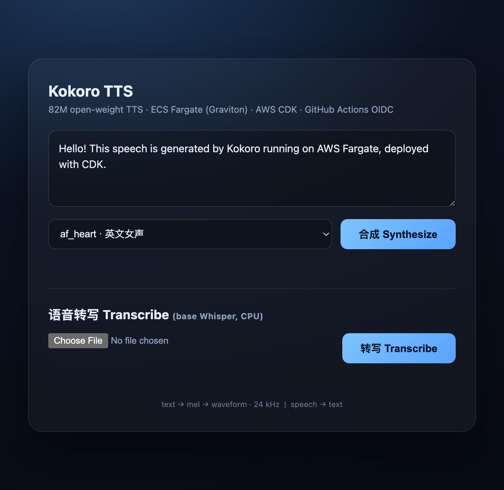
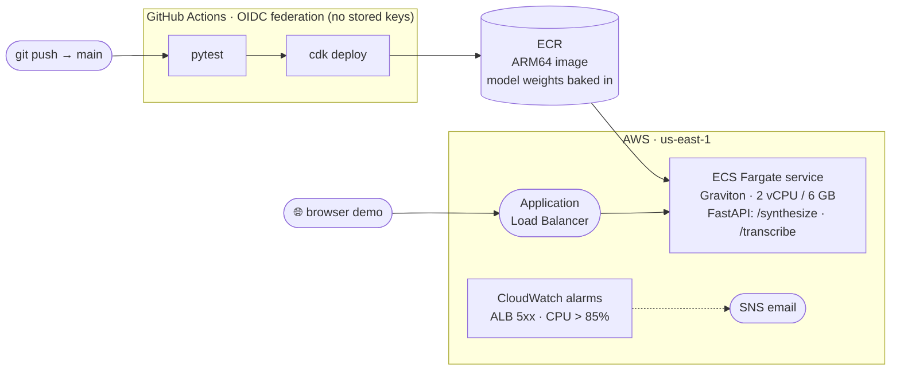
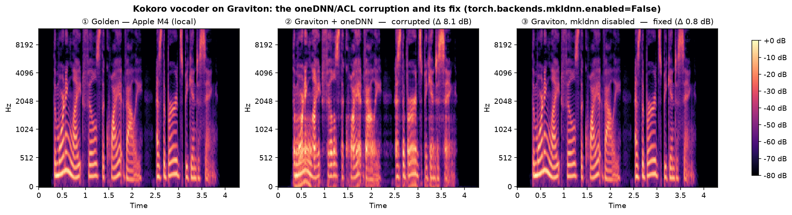
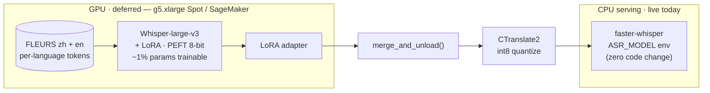
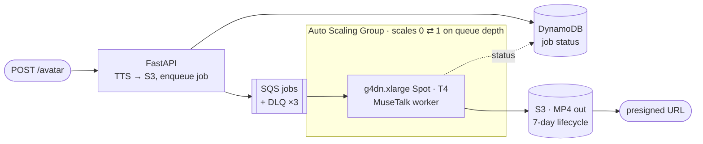

<div align="center">

# 🎙️ kokoro-aws-demo

**Open-weight speech AI — TTS *and* ASR — shipped as a production-style service on AWS.**

Kokoro-82M text-to-speech on **ECS Fargate / Graviton**, a CPU Whisper transcription endpoint,
100% **AWS CDK** infrastructure, and **keyless OIDC CI/CD** — plus a GPU **LoRA fine-tuning** track
and a scale-to-zero avatar pipeline.

[](https://github.com/HenryVarro666/kokoro-aws-demo/actions/workflows/deploy.yml)




<sub><em>One Fargate task, one page: type text → hear 24 kHz speech, or upload audio → get a transcript. Bilingual (EN/中文).</em></sub>

</div>

---

## At a glance

|  |  |
|---|---|
| **Serving** | FastAPI on **ECS Fargate** (ARM64 / Graviton), 2 vCPU · 6 GB, behind an Application Load Balancer |
| **Endpoints** | `POST /synthesize` (Kokoro-82M TTS) · `POST /transcribe` (Whisper ASR, CPU) · `POST /avatar` (async, Phase 3) |
| **IaC** | **100% AWS CDK (Python)** — VPC, ECS, ALB, health checks, CloudWatch alarms, IAM, SQS/DynamoDB/ASG |
| **CI/CD** | **GitHub Actions + OIDC** role federation — zero long-lived AWS keys in the repo |
| **Observability** | CloudWatch alarms (ALB 5xx · CPU > 85%) → SNS email, all defined as code |
| **ML track** *(built, not yet run at scale)* | Whisper + **LoRA** (PEFT) → **CTranslate2 int8**, bilingual zh/en — hot-swaps into CPU serving via `ASR_MODEL` |
| **Cost** | **~$74/mo** always-on · `cdk destroy` → **$0** · training runs $2–7 each on Spot |

---

## Architecture

From `git push` to a live URL, with no AWS keys ever stored in the repo:



### Endpoints

| Endpoint | Model | Device | Status |
|---|---|---|---|
| `POST /synthesize` | Kokoro-82M (open-weight TTS) → 24 kHz WAV | CPU (Graviton) | ✅ live |
| `POST /transcribe` | faster-whisper `base`, int8 (speech → text) | CPU (Graviton) | ✅ live |
| `POST /avatar` + `GET /avatar/{id}` | MuseTalk talking-head → MP4 | GPU (g4dn Spot) | 💤 503 until `AvatarStack` is deployed |
| `GET /health` | — | — | ✅ ALB target health check |

---

## ⚡ Engineering war story — the Graviton vocoder bug

Kokoro on Fargate/Graviton shipped **audibly degraded, "robotic" speech**. I caught it by ear — a
synthesized clip *sounded wrong* — not from a failing test.

**Diagnose against a *golden* reference, not an internal one.** Synthesizing the same text on the
Graviton service vs. locally on Apple Silicon (the golden reference) exposed it: the cloud output was
**−6 dB quieter, ~8 dB log-mel spectral distance**, with smeared harmonics (panel ②).



**Root cause:** PyTorch's **oneDNN (ACL) CPU backend on aarch64** miscomputes the vocoder's convolutions —
**independent of thread count**, on the pinned `torch==2.12.0`. An earlier workaround (`OMP_NUM_THREADS=1`,
on the theory that multi-threaded kernels were the culprit) turned out **insufficient**: the single-threaded
service was *still* corrupted (panel ②).

**Fix — one line, disable the oneDNN backend before the vocoder runs:**

```python
torch.backends.mkldnn.enabled = False   # app/main.py, in get_pipeline()
```

This restores golden-matching audio — **0.8 dB spectral distance = the run-to-run noise floor** (panel ③) —
and it's **latency-neutral** (end-to-end RTF ≈ 1.5 on the 2 vCPU Graviton task, unchanged). Verified by a
golden-referenced spectral A/B on Fargate *and* on the live redeployed service (0.74 dB vs golden).

> **Lessons:** (1) a "faster" config that *sounds* wrong beats a green test suite; (2) always A/B against a
> **golden** reference — comparing cloud-to-cloud once hid this bug in plain sight; (3) re-verify old
> "fixes": the `OMP_NUM_THREADS=1` workaround had silently decayed after a `torch` bump.

---

## Engineering decisions & trade-offs

The "why" behind the code — each of these is a deliberate call, not a default:

| Decision | Why |
|---|---|
| **`torch.backends.mkldnn.enabled=False`** | torch's oneDNN (ACL) backend corrupts the Kokoro vocoder on Graviton, *thread-independently* (see war story). Disabling it restores golden audio; the older `OMP_NUM_THREADS=1` guard proved insufficient. |
| **NAT-less VPC** (public subnets) | A NAT gateway is ~$32/mo — the classic beginner bill trap. Tasks pull images via public IP instead. |
| **OIDC, not access keys** | Actions assumes a repo-scoped role via web identity — no long-lived secrets to leak or rotate. |
| **Model weights baked into the image** | Deploy == ready: no cold-start downloads, and rollback is just switching an image tag. |
| **Circuit breaker + auto-rollback** | A bad image fails fast and reverts instead of hanging ~3h; `min 100%` keeps the old task serving. |
| **`paths-ignore` on docs & training** | Defense-in-depth after a "training commit redeployed prod" incident — ML/doc commits never touch the live service. |
| **`/transcribe` is a *sync* def** | faster-whisper is CPU-bound/blocking; a sync endpoint runs in FastAPI's threadpool so a long job can't starve the event loop and hang `/health` (which would make the ALB kill the task). Guarded by a regression test. Its `cpu_threads=2` is pinned separately from the vocoder's `OMP_NUM_THREADS=1`. |
| **Scale-to-zero GPU worker** | The Phase-3 avatar ASG runs **0** instances when idle; a g4dn Spot spins up only on SQS depth, then scales *itself* back to 0. |

---

## Quickstart (local)

```bash
python3.12 -m venv .venv && source .venv/bin/activate   # kokoro needs Python >=3.10,<3.13
pip install -r requirements.txt                          # torch arrives as a kokoro dependency
uvicorn app.main:app --reload                            # open http://127.0.0.1:8000
```

```bash
# TTS: text → speech
curl -X POST localhost:8000/synthesize \
  -H 'content-type: application/json' \
  -d '{"text":"Hello from Kokoro on AWS Fargate.","voice":"af_heart"}' --output hello.wav

# ASR: speech → text
curl -X POST localhost:8000/transcribe -F file=@hello.wav
```

**Tests** (no model or network needed — `SKIP_MODEL_LOAD=1` is set inside them):

```bash
pip install -r requirements-dev.txt && pytest -v
```

---

## Deploy

```bash
cd infra
python3 -m venv .venv && source .venv/bin/activate && pip install -r requirements.txt
cdk bootstrap                 # once per account + region
cdk deploy OidcStack          # once — creates the GitHub OIDC deploy role
cdk deploy InfraStack         # power on — prints the demo URL (changes each deploy)
cdk destroy InfraStack        # power off → $0
```

**CI/CD:** merges to `main` auto-deploy via GitHub Actions OIDC. Add `[skip deploy]` to a commit message to
land changes while the stack stays destroyed; trigger manual deploys from the **Actions** tab (`workflow_dispatch`).
Forking? Point `GITHUB_REPO` (`infra/infra/oidc_stack.py`) and `ROLE_ARN` (`.github/workflows/deploy.yml`) at your
own account first.

---

## Training track (Phase 2)

A GPU fine-tuning path that feeds the **CPU** serving endpoint — decoupled so the service ships today and the
better model drops in later with **zero code change** (just point `ASR_MODEL` at the converted weights).



- **Bilingual by construction:** each FLEURS sample is tokenized with its own language token
  (`set_prefix_tokens(language=...)`) *before* the zh + en sets are concatenated — otherwise the model
  learns the wrong prefix.
- **Evaluation harness — with real numbers:** `evaluate_cer.py` reports **CER for Chinese** (no word boundaries) and
  **WER for English**, before/after the adapter. Baseline smoke-test today (`whisper-tiny`, FLEURS, n=100, *no fine-tuning yet*):
  **CER(zh) = 0.70 · WER(en) = 0.31**. The weak Chinese baseline is precisely what the bilingual LoRA targets — the
  large-v3 before/after lands with Phase 2b.
- **Runnable everywhere:** `train.py` does a Mac CPU smoke test; `launch_sagemaker.py` runs a managed Spot job;
  `training/colab_finetune.ipynb` fine-tunes on a free Colab T4.

---

## Phase 3 — async avatar pipeline (scaffolded)

`POST /avatar` synthesizes speech, drops it on a queue, and returns a job id; a GPU worker that **scales to zero**
renders a MuseTalk talking-head and hands back a presigned MP4. The API degrades cleanly (**503**) until the stack
is deployed.



```bash
cdk deploy --context avatar=true --context avatar_ami=ami-XXXX --all
```

---

## Roadmap

- [x] **Phase 1** — TTS service: Fargate + CDK + OIDC CI/CD
- [x] **Phase 2a** — `/transcribe` live on base Whisper (faster-whisper, CPU, int8)
- [ ] **Phase 2b** — swap in the LoRA-fine-tuned, CT2-int8 model via `ASR_MODEL` *(deferred until GPU quota; `training/` is ready)*
- [ ] **Phase 3** — talking-head avatar (MuseTalk): `/avatar` → SQS → scale-to-zero GPU worker → MP4 *(code in place)*

---

## Repo layout

```
app/            FastAPI service — /synthesize (Kokoro TTS), /transcribe (Whisper ASR), /avatar (dormant)
infra/          AWS CDK (Python) — InfraStack (Fargate/ALB/alarms), OidcStack (CI trust), AvatarStack (Phase 3)
training/       Whisper LoRA — train.py, evaluate_cer.py, merge_and_convert.sh, launch_sagemaker.py, Colab notebook
avatar_worker/  SQS-driven MuseTalk GPU worker (Phase 3)
Dockerfile      ARM64 image — torch 2.12.0 pinned, TTS + ASR weights baked in
.github/        GitHub Actions OIDC CI/CD (test → deploy, with a paths-ignore prod guard)
```

`CLAUDE.md` documents the load-bearing constraints (why `OMP_NUM_THREADS=1` must not be "optimized away", etc.)
for contributors and coding agents.

## License

MIT — see [LICENSE](LICENSE).
